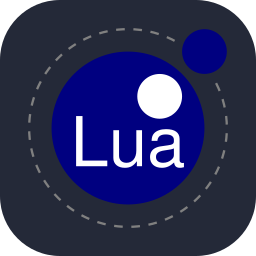
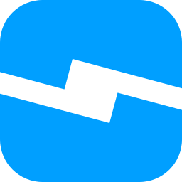

# Hello! 👋
I am a 13 year old student who's enthusiastic about programming, game development, CAD, mechanical engineering and robotics.

## Some things I've learnt and confident about:
      

## Some things I've been learning lately:
      

## Fun Fact:
 
Lua is my favorite language, because of its simplicity and its uniqueness(it starts indexing from 1)!

## Currently working on:
- A real flying ornithopter
- Some other small websites

<!--
**jyotiradityaBiswas/jyotiradityaBiswas** is a ✨ _special_ ✨ repository because its `README.md` (this file) appears on your GitHub profile.

Here are some ideas to get you started:

- 🔭 I’m currently working on ...
- 🌱 I’m currently learning ...
- 👯 I’m looking to collaborate on ...
- 🤔 I’m looking for help with ...
- 💬 Ask me about ...
- 📫 How to reach me: ...
- 😄 Pronouns: ...
- ⚡ Fun fact: ...
-->
